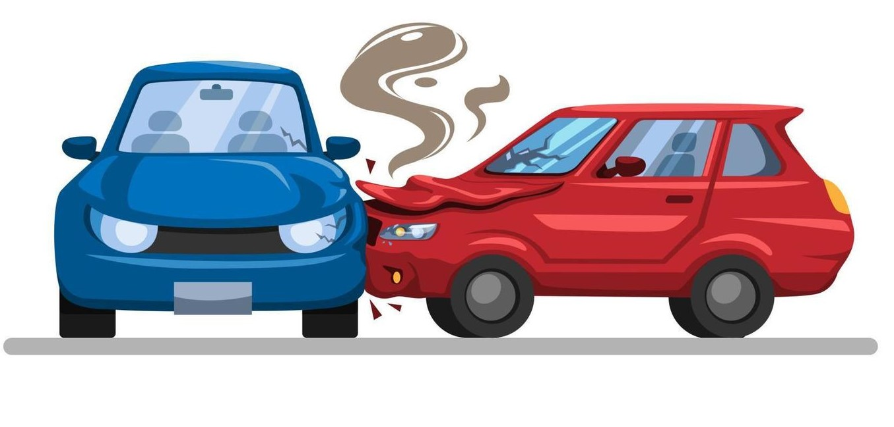

```{r setup, include=FALSE}
knitr::opts_chunk$set(echo = TRUE)
```

# Introduction

**Why road accidents?**

Every day when you read the newspaper, you must have come across news about the occurrence of road accidents in some form or the other. And must have wondered what all are the causes of such occurrences and how can they be minimized. 
Deaths due to road accidents are a leading cause of death in India. Road accidents are multi-causal and are often the result of an interplay of various factors like:

* Human errors 
* Driving under the influence of drug or alcohol
* Vehicular condition
* Weather condition
* Time of occurrence of Accidents

This project aims to analyze these various factors and how they individually affect road accidents in India.



# Drunk Driving In Gujrat

**Did banning alcohol in Gujarat in the year 2009 help in reducing road accidents in the state?**

The data for analyzing the question posed was scraped from <https://cot.gujarat.gov.in/road-accidents.htm> .i.e. The official website of the Commisionerate of Transport, Government of Gujarat. The data has the following columns:

1. Year
2. Number of Accidents
3. Number of Deaths
4. Number of Persons Injured
5. 100 Accident Average
6. Number of Accident per 1000 (thousand) registered Vehicles
7. Number of Vehicle Registered


The data was cleaned and only the first three columns were kept in the final data frame.


To analyze this data, a multiple-line graph was plotted in R.  This graph was suitable for the given dataset as it shows the trend clearly and justifies the dataset.


```{r DrunkDriving, echo=FALSE}
library(ggplot2)
load("Guj_data.Rdata")
load("Registered_vehicle.Rdata")
load("Time_wise_data.Rdata")
load("all_state_Data.Rdata")
load("Weather 2018.Rdata")
load("weatherPlot.Rdata")
load("population_data.Rdata")
load("latitude.Rdata")
load("data.Rdata")

Guj <- X_Gj
p <- ggplot(Guj,aes(x = Year, y = Incidents, color = Type)  )+
        geom_point() +
        geom_smooth(method = "gam",  formula = y ~ s(x, bs = "cs"), alpha = .2) +
        geom_vline(xintercept = 2009, col = "black", lwd = 1, show.legend = TRUE,linetype = "dashed") + theme_classic()+
        geom_text(aes(x = 2009 ,y = (max(Incidents)+min(Incidents))/2,  label = "\n ALCOHOL BANNED") , col = "black", angle = 90, lwd = 4)+
        labs(title ="Road Accidents in Gujrat" ) + theme(plot.title = element_text(face="bold"))+ theme(plot.title = element_text(hjust = 0.5))+
        xlab("Year") + ylab("Number of Incidents")+
        labs(caption = "(based on data from https://cot.gujarat.gov.in/road-accidents.htm )")

        p


```

**Observations**


1. The trend line of the number of road accidents can be seen having a clear dip after the year 2009, which implies that banning alcohol probably has helped curb road accidents in Gujarat.

2. The trend line of the number of deaths which was increasing as the years passed, shows control in the number of deaths after the year 2009. 

# Effect of the Number of Vehicles

**Is there any relationship between the number of registered vehicles in a city with the total number of accidents in the city with respect to the population of the city?**

The objective is to analyze road accidents in major cities of the country. By major cities here we mean cities having a population of more than 1 million.

**Data**

* The data on the number of vehicles registered in each city The data for the number of road was obtained from <https://data.gov.in> in csv format. 

* The population for the states was downloaded from Wikipedia .  <https://en.wikipedia.org/wiki/List_of_cities_in_India_by_population>

* The number of road accidents in the cities was obtained from <https://data.gov.in> in csv format.

The data sets were then merged but it required some cleaning. The following steps were taken to clean the data:

1. There were some cities in the file containing the number of vehicles registered in each city, that were not present in the dataset containing the accidents in each state. And, hence those cities were then omitted from both files and only the common ones were retained.

2. And the population of only these cities was filtered and the final data frame was made having these three variables.


In the following figure, log of the number of accidents in a given city is ploted against the log of the total number of regidtered Cars of a given tyoe, color of the points is used to represent the order of magnitude of the population of the city and the number of deaths in that city is represented by the size of the point. The base of the logorithm is 10.

```{r RegisteredVehicles , echo=FALSE}
    library(ggplot2)
load("Guj_data.Rdata")
load("Registered_vehicle.Rdata")
load("Time_wise_data.Rdata")
load("all_state_Data.Rdata")
load("Weather 2018.Rdata")
load("weatherPlot.Rdata")
load("population_data.Rdata")
load("latitude.Rdata")
load("data.Rdata")

        NumberOfVehicles <-  city_info[,'Cars']
        CityPopulation <-  factor(round(log10(city_info$Population)))

        q <-ggplot(city_info, aes(x = log10(NumberOfVehicles) , y = log10(Cases), color = CityPopulation, label = City)) +
            geom_point(alpha= 0.7, show.legend = TRUE, aes(size = Deaths)) +
            geom_text(aes(label=ifelse(Population>2.5e6,City,''), size = 12),hjust=0,vjust=0, size = 3) +
            geom_smooth(method = "lm", alpha = .0, formula = y~x, aes(color = CityPopulation))+  theme_classic()+
            xlab(paste("Log of the Number of Cars")) + ylab("Log of the Number of Accidents")  +
            labs(title = "   Number of Road Accidents in Major Cities of India") +
            theme(plot.title=element_text(hjust=0.5))+ theme(plot.title = element_text(face="bold"))+
            guides(color =guide_legend(title="Order of magnitude of the Population"))
        q
```

**Observations** 

1. There are clear visuals of two outliers in the plot, namely Mumbai and Chennai as they deviate strongly from the average trend line.

    * *Mumbai*: We can see that this state has a large population, but has less number of registered vehicles and fewer road accidents.

    * *Chennai*: The state has a moderate population but has a high number of registered vehicles and a large number of road accidents.

A possible reason for this can be 

    * Mumbai has invested a great deal in road safety by installing CCTV cameras, traffic lights, and good traffic policing. They have imposed a fine ranging from 1000-5000 rupees for overspeeding and other traffic rule violations.
    
    * Chennai on the other hand has everything that can cause a road accident, from dysfunctional traffic signals and street lights to bad traffic policing. They have imposed a fine ranging from 150-300 rupees for overspeeding and other traffic rules violations.

2. It can be observed that the number of road accidents in a city is positively correlated to the number of registered motor vehicles it has. Moreover the slope of the best fit line is more in case of larger cities which suggest that the number of vehicle in a city has a greater impact on road accidents in case of larger cities. This couse be due to high *Vehicle Density* (Number of Vehicles per unit lenght of road) in larger cities.

# Causewise Distribution of Road Accidents

**What are the major causes of road accidents in Indian states?**

The objective is to analyze the causes affecting road accidents in all states of India and also compare which cause is the major cause affecting road accidents in each state.

**Data**

1. Cause-wise distribution of road accidents in each state has been downloaded from <https://data.gov.in> in .csv format for the years 2015 to 2020.

2. Estimated population of the states of 2019 for a better comparison of causes has been scraped from <https://statisticstimes.com/demographics/india/indian-states-population.php>


UTs and city wise data for all causes has been removed from cause wise distribution of road accidents.
For fair comparision, total number of accidents per million of population was calculated for every state by using estimated population of states of 2019.

```{r Cusewise, echo=FALSE}
library(ggplot2)
library(reshape2)
load("Guj_data.Rdata")
load("Registered_vehicle.Rdata")
load("Time_wise_data.Rdata")
load("all_state_Data.Rdata")
load("Weather 2018.Rdata")
load("weatherPlot.Rdata")
load("population_data.Rdata")
load("latitude.Rdata")
load("data.Rdata")


        X <- melt(allData[[6]][[3]], value.name = "incidents", variable.name = "Cause", id.vars  = "State")
        r<- ggplot(X, aes(State, incidents, fill = Cause)) +
            geom_bar(stat = 'identity')+
            ylab( "Accidents per 1,000,000 of the population")+
            coord_flip() + theme_classic()+
            labs(title = "Causes of Accidents in States of India") +
            theme(plot.title=element_text(hjust=0.5)) + theme(plot.title = element_text(face="bold"))

        r
```

**Observations**

1. Overspeeding and careless driving are major causes of road accidents in every state.

2. The plot is plotted against the "Accidents per million population". And we can see observe that despite Goa and Sikkim having similar populations, Goa has recorded more accidents than Sikkim. This could be due to a large number of tourist (driving) visiting goa as they will increase the number of accidents but will not be counted in the population thus creating a bias in the data. Also Goa has a greater number of vehicles than Sikkim which could also play a role in the large number of accidents observed.

Here is the tourism data for indian states. It should be noted that Tamil Nadu has more Tourist to Population ratio but has a low number of accidents per million of the population, so we may only conclude that there are multiple factors at play here.

```{r tourism, echo=FALSE}
library(ggplot2)
load("Guj_data.Rdata")
load("Registered_vehicle.Rdata")
load("Time_wise_data.Rdata")
load("all_state_Data.Rdata")
load("Weather 2018.Rdata")
load("weatherPlot.Rdata")
load("population_data.Rdata")
load("latitude.Rdata")
load("data.Rdata")


X <- data.frame('State'= pop_data$States,"Population" = pop_data$Population,"Tourists"=  tour_data$Tourists)
X <- X[order(X$Tourists/X$Population), ]
s <- ggplot(X, aes(x = reorder(State, Tourists / Population), y = 100*Tourists / Population)) +
    geom_bar(stat = 'identity', fill = "blue", alpha =.4) + coord_flip() + theme_classic() + ylab("Number of Tourists per hundred residents")+ xlab("State") + labs(title = "Bar plot showing Tourism in Different States")

s
```


# Effect of Weather on Road Accidents

**How does weather affect road accidents in different states of the country?**

Weather impacts not just the road surface condition but also the visibility of the road user thereby increasing the chances of road accidents. Heavy rain, dense fog, and hail storms reduce visibility and make the road surface slippery thus posing serious risks to road users. 

**Data**

The data set is available in table form in the publications (PDFs) released every year by the Ministry of Road Transport and Highways of the Road Accidents in India. <https://morth.nic.in> 
The PDF is first converted to a word document through online available converters and then the required table is copied into a .csv file and is now ready to use.

We have used data from the year 2018 for the visualization from <https://morth.nic.in/sites/default/files/Road_Accidednt.pdf> 

The data has 5 weather conditions, namely

1. Sunny/clear
2. Rainy
3. Foggy & Mist
4. Hail
5. Other

All of them have subheadings, namely

* Total accidents

    + Number
    
    + Rank
    
* Persons killed 

    + Number

    + Rank
* Persons injured

    + Grievously injured
    
    + Minor injured
    
    + Total injured

Rows have all states and UTs of India.

We removed Others from weather conditions and rank, grievously and minor from sub-subheadings. Now, this is the data frame that we used to analyze the effect of weather conditions on road accidents in different states.


The map of India is plotted to see the effect of weather conditions on road accidents in all states and UTs. The shade of color shows the number of road accidents in that particular state, the darker the shade, the more the number of road accidents.

```{r WeatherAnalysis , echo = FALSE}
load("Guj_data.Rdata")
load("Registered_vehicle.Rdata")
load("Time_wise_data.Rdata")
load("all_state_Data.Rdata")
load("Weather 2018.Rdata")
load("weatherPlot.Rdata")
load("population_data.Rdata")
load("latitude.Rdata")
load("data.Rdata")

plot(p5)
```

**Observations**

1. Uttar Pradesh and Tamil Nadu record the maximum number of road accidents, be it any type of weather.

* Being the maximum populated and fourth largest state in the country might be the reason for Uttar Pradesh having a maximum number of road accidents.

2. Assam and Odisha have reported comparatively more road accidents in the rainy season than in any other weather condition.

* Heavy rainfall in these states might be a possible reason for this increase in the number of road accidents in these states.

3. The Foggy and Hail Season witnesses comparatively low road accidents all over India, specifically in the coastal regions.

# Effect of Latitude on Road Accidents in States

**Does the latitude of a place affect the occurrence of accidents in that area ?**

The maps above indicate a general trend that south india experiences more road accidents than north india, so to find the truth about this the number of accidents were ploted against the latitude for each state.

**Data** 

The data set for Road Accidents is available in table form in the publications (PDFs) released every year by the Ministry of Road Transport and Highways of the Road Accidents in India. <https://morth.nic.in> 
The PDF is first converted to a word document through online available converters and then the required table is copied into a .csv file and is now ready to use.

We have used data of number of accidents in each state  for the year 2018 from <https://morth.nic.in/sites/default/files/Road_Accidednt.pdf> 

The data of latitude of all the states is web scrapped from the website <https://www.classmate4u.com/latitude-and-longitude-of-india/>  while the column of longitude was removed and the latitude of Gujarat was added manually. 

```{r latitude, echo= FALSE }
library(ggplot2)
load("Guj_data.Rdata")
load("Registered_vehicle.Rdata")
load("Time_wise_data.Rdata")
load("all_state_Data.Rdata")
load("Weather 2018.Rdata")
load("weatherPlot.Rdata")
load("population_data.Rdata")
load("latitude.Rdata")
load("data.Rdata")

latitude2018

```

**Observations**

From the plot, we see the following: -

* A decrease in the number of accidents is observed as the latitude increases.

* But when States are grouped according to the population, no corelation is obtained between road accidents and the latitude of a state.So, it would be inappropriate to conclude that the occurrence of accidents decreases with an increase in latitude.


# Time of Occurence

**What hours of the day witness the most number of accidents?**

The data set was available in table form in the publications (PDFs) released every year by the Ministry of Road Transport and Highways of the Road Accidents in India. <https://morth.nic.in> 
The PDF was first converted to a word document and then the required table was copied into a .csv file and was then ready to use.

The data set has three columns: 
1. Hours
2. Number of Accidents
3. Type
 
The third column 'TYPE'was manually added in the dataset to categorize the hours into day and night.


A bar graph was plotted to see the time of occurrence of road accidents which observes the maximum number of road accidents in a day. The color was added with respect to the 'TYPE' variable that is it colored the graph categorizing it into day and night.

```{r TimeOfOccurence, echo=FALSE}
load("Guj_data.Rdata")
load("Registered_vehicle.Rdata")
load("Time_wise_data.Rdata")
load("all_state_Data.Rdata")
load("Weather 2018.Rdata")
load("weatherPlot.Rdata")
load("population_data.Rdata")
load("latitude.Rdata")
load("data.Rdata")

X_timewise <- TimeWiseData[[1]]
        p <- ggplot(X_timewise, aes(x = `Time of Occurence`, y = `Number of Accidents`, fill = `Day or Night`))+
            geom_bar(stat = 'identity') + ylim(min = 0, max = 90000)+ ylab("Number of Accidents in 2008") + coord_flip() + theme_classic()+
            labs(title = "Road Accidents in India V/S Time of Occurrence") + theme(plot.title = element_text(face="bold"))+
            theme(plot.title=element_text(hjust=0.5))
        p
```
**Observations**

The maximum number of road accidents occur in the time period of 9:00 a.m. to 

1. 6:00 p.m. in the day.
2. 6:00 p.m. to 9:00 p.m. witness maximum road accidents in the night.

# References 

<https://timesofindia.indiatimes.com/city/mumbai/mumbai-5th-among-cities-to-curb-road-accidents-in-a-year/articleshow/78801577.cms>

<https://en.wikipedia.org/wiki/Road_accidents_in_Tamil_Nadu>

<https://www.dailypioneer.com/2013/page1/states-asked-to-emulate-guj-in-good-spirit.html>

